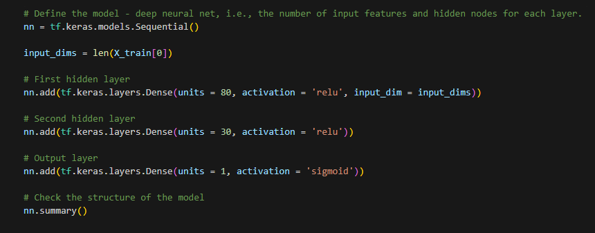

## Overview of the Analysis
The nonprofit foundation Alphabet Soup wants a tool that can help it select the applicants for funding with the best chance of success in their ventures. With your knowledge of machine learning and neural networks, you’ll use the features in the provided dataset to create a binary classifier that can predict whether applicants will be successful if funded by Alphabet Soup.

From Alphabet Soup’s business team, you have received a CSV containing more than 34,000 organizations that have received funding from Alphabet Soup over the years. Within this dataset are a number of columns that capture metadata about each organization, such as:
 - EIN and NAME—Identification columns
 - APPLICATION_TYPE—Alphabet Soup application type
 - AFFILIATION—Affiliated sector of industry
 - CLASSIFICATION—Government organization classification
 - USE_CASE—Use case for funding
 - ORGANIZATION—Organization type
 - STATUS—Active status
 - INCOME_AMT—Income classification
 - SPECIAL_CONSIDERATIONS—Special considerations for application
 - ASK_AMT—Funding amount requested
 - IS_SUCCESSFUL—Was the money used effectively

## Results

### Data Preprocessing
 - What variable(s) are the target(s) for your model? 
    - IS_SUCCESSFUL
 - What variable(s) are the features for your model?
    - APPLICATION_TYPE
    - AFFILIATION
    - CLASSIFICATION
    - USE_CASE
    - ORGANIZATION
    - STATUS
    - INCOME_AMT
    - SPECIAL_CONSIDERATIONS
    - ASK_AMT
 - What variable(s) should be removed from the input data because they are neither targets nor features?
    - EIN
    - NAME

### Compiling, Training, and Evaluating the Model
 - How many neurons, layers, and activation functions did you select for your neural network model, and why?
    - 
 - Were you able to achieve the target model performance?
    - No, out of the my 3 models I could not get closer than 73% so I could not achieve the target model performance higher than 75%.
 - What steps did you take in your attempts to increase model performance?
    - I tried adding another layer with 10 units and then I also tried using a linear activation in my output layer.

## Summary
The deep learning model only achieved 73% accuraacy which was under the target model performance. After serveal attempts to optimize the model the accuracy only worsened. 

